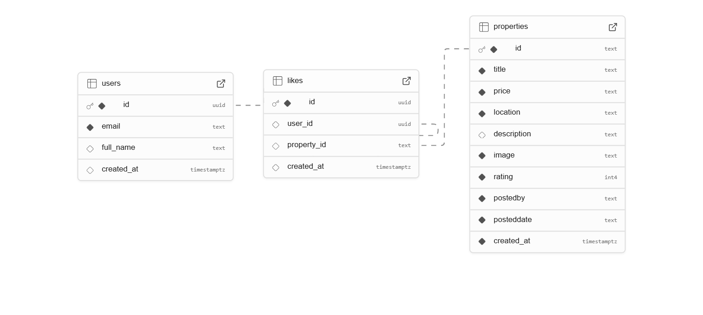

# 🏡 Real Estate App
A Real Estate App built using Expo (React Native) with Supabase as the backend and a SQL database. This app allows users to sign up, log in, explore properties, add properties, like them, and manage their profiles efficiently.

## 📸 Screenshots

<table>
  <tr>
    <td align="center">
      
      <br/>Sign Up Page
    </td>
    <td align="center">
      
      <br/>Login Page
    </td>
    <td align="center">
      
      <br/>Home Tab
    </td>
    <td align="center">
      
      <br/>Filter Page
    </td>
  </tr>
  <tr>
    <td align="center">
      
      <br/>Property Details
    </td>
    <td align="center">
      
      <br/>Add Property Tab
    </td>
    <td align="center">
      
      <br/>Like Tab
    </td>
    <td align="center">
      
      <br/>Profile Page
    </td>
  </tr>
</table>


## 📊 Database Schema


Database schema design to structure and manage property and user data efficiently.
🚀 Getting Started

## 📚 Features

1. **Authentication**
   - User Signup & Login (with validation)
   - Secure session handling using Supabase Auth

2. **Home Tab 🏠**
   - List of available properties displayed as cards
   - Property details page on clicking a card
   - Search bar with filters for refining results

3. **Add Property Tab ➕**
   - Allows authenticated users to add new properties
   - Fields include property name, price, location, etc.

4. **Like Tab ❤️**
   - Displays a list of liked properties in card format
   - Easy access to favorite properties

5. **Profile Page 👤**
   - View and edit user profile
   - Logout functionality


## 🛠️ Tech Stack
- Frontend: React Native (Expo)
- Backend: Supabase
- Database: SQL
- Authentication: Supabase Auth

1. Clone the Repository
```bash
git clone https://github.com/shrinivask007/real-estate-app
cd real-estate-app
```
2. Install Dependencies
```bash
npm install
```
3. Configure Environment Variables
Create a `.env` file in the root directory with the following values:
```
SUPABASE_URL=<your-supabase-url>
SUPABASE_KEY=<your-supabase-api-key>
```
4. Run the App
```bash
npx expo start
```
## 📄 API Configuration
Supabase API is used to fetch, update, and manage property data. Authentication is handled with Supabase Auth.
## 📝 Contributing
Contributions are welcome! Feel free to create a pull request.
## 📧 Contact
For any questions or suggestions, reach out at:
**Email:** [shrinivassk18@gmail.com](mailto:shrinivassk18@gmail.com)
## 📜 License
This project is licensed under the MIT License - see the LICENSE file for details.

# Welcome to your Expo app 👋

This is an [Expo](https://expo.dev) project created with [`create-expo-app`](https://www.npmjs.com/package/create-expo-app).

## Get started

1. Install dependencies

   ```bash
   npm install
   ```

2. Start the app

   ```bash
    npx expo start
   ```

In the output, you'll find options to open the app in a

- [development build](https://docs.expo.dev/develop/development-builds/introduction/)
- [Android emulator](https://docs.expo.dev/workflow/android-studio-emulator/)
- [iOS simulator](https://docs.expo.dev/workflow/ios-simulator/)
- [Expo Go](https://expo.dev/go), a limited sandbox for trying out app development with Expo

You can start developing by editing the files inside the **app** directory. This project uses [file-based routing](https://docs.expo.dev/router/introduction).

## Get a fresh project

When you're ready, run:

```bash
npm run reset-project
```

This command will move the starter code to the **app-example** directory and create a blank **app** directory where you can start developing.

## Learn more

To learn more about developing your project with Expo, look at the following resources:

- [Expo documentation](https://docs.expo.dev/): Learn fundamentals, or go into advanced topics with our [guides](https://docs.expo.dev/guides).
- [Learn Expo tutorial](https://docs.expo.dev/tutorial/introduction/): Follow a step-by-step tutorial where you'll create a project that runs on Android, iOS, and the web.

## Join the community

Join our community of developers creating universal apps.

- [Expo on GitHub](https://github.com/expo/expo): View our open source platform and contribute.
- [Discord community](https://chat.expo.dev): Chat with Expo users and ask questions.
